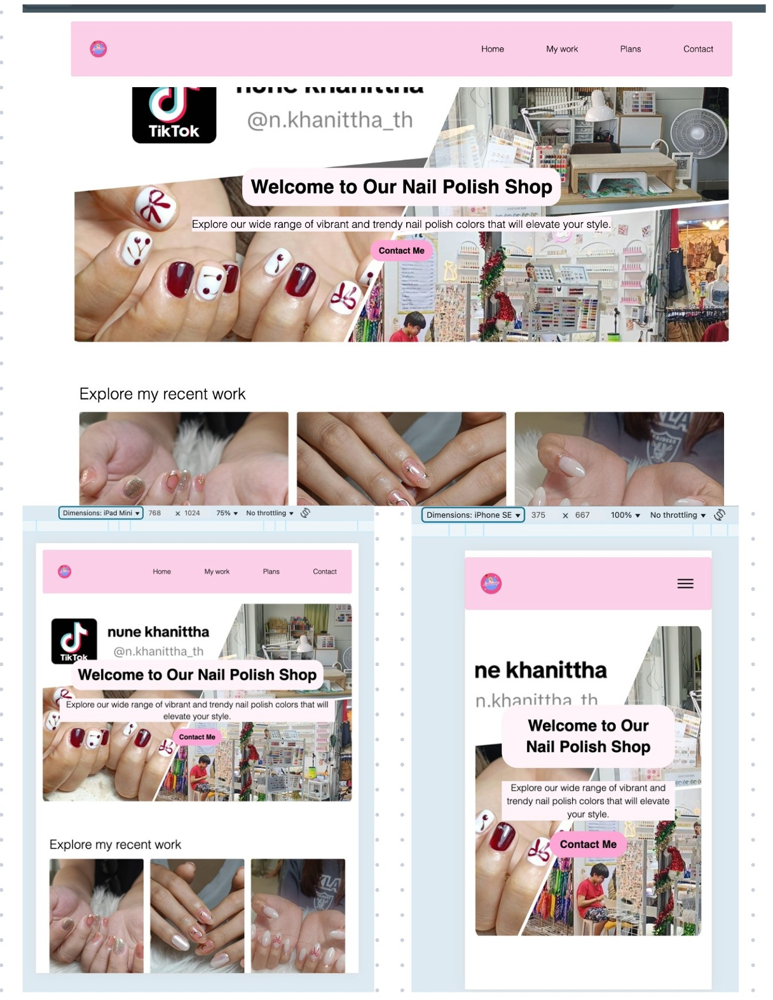

# KH Fullstack App

This is a monorepo for the **Lollipop Nails Shop** project, containing:

- **kh-app-front-end**: Public-facing website (React + Vite + Tailwind CSS)
- **kh-app-dashboard**: Admin dashboard (React + Vite + Tailwind CSS)
- **kh-app-back-end**: REST API backend (Node.js + Express + MongoDB + AWS S3)

---


## Webiste


## Project Structure

```
kh-fullstack-app/
│
├── kh-app-front-end/      # Public website (React)
├── kh-app-dashboard/      # Admin dashboard (React)
├── kh-app-back-end/       # Backend API (Node.js/Express)
├── docker-compose.yml     # Multi-container orchestration
└── README.md              # Project documentation
```

---

## Prerequisites

- [Node.js](https://nodejs.org/) (v20 recommended)
- [Docker](https://www.docker.com/) & [Docker Compose](https://docs.docker.com/compose/)
- [MongoDB](https://www.mongodb.com/) (if running locally)
- AWS S3 bucket (for image uploads)

---

## Getting Started

### 1. Clone the Repository

```sh
git clone https://github.com/your-username/kh-fullstack-app.git
cd kh-fullstack-app
```

### 2. Environment Variables

- Copy `.env.example` (if available) to `.env` in each app folder and fill in the required values.
- For backend, set up MongoDB and AWS credentials in `kh-app-back-end/.env`.

### 3. Running with Docker Compose

This will start all services (frontend, dashboard, backend, MongoDB):

```sh
docker-compose up --build
```

- Public website: [http://localhost:3000](http://localhost:3000)
- Dashboard: [http://localhost:3001](http://localhost:3001)
- Backend API: [http://localhost:5000/api/v1](http://localhost:5000/api/v1)

### 4. Running Locally (Development)

#### Backend

```sh
cd kh-app-back-end
npm install
npm run dev
```

#### Frontend (Public)

```sh
cd kh-app-front-end
npm install
npm run dev
```

#### Dashboard

```sh
cd kh-app-dashboard
npm install
npm run dev
```

---

## Features

- **Public Website**: Landing page, gallery, pricing, contact, social media links.
- **Dashboard**: Admin login, edit website content, upload images, manage locations.
- **Backend**: REST API, authentication, MongoDB storage, AWS S3 image uploads.

---

## Tech Stack

- **Frontend**: React, Vite, Tailwind CSS, Zustand, Axios
- **Backend**: Node.js, Express, MongoDB, Mongoose, AWS S3, Multer
- **DevOps**: Docker, Docker Compose, Nginx

---

## Useful Scripts

- `npm run dev` – Start development server
- `npm run build` – Build for production
- `npm run lint` – Lint code
- `npm run preview` – Preview production build

---

## License

This project is licensed under the MIT License.

---

## Author

Gregorio Eyi (GP) 
